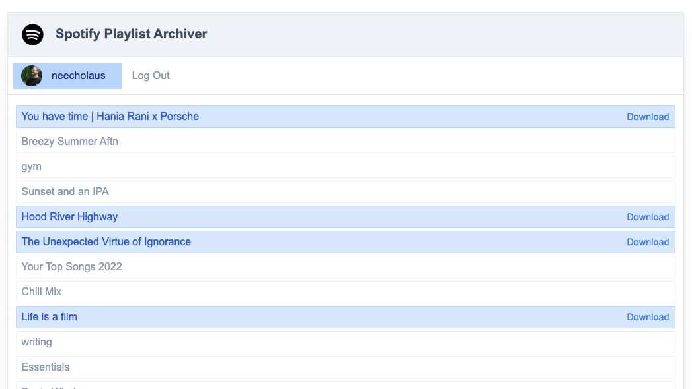
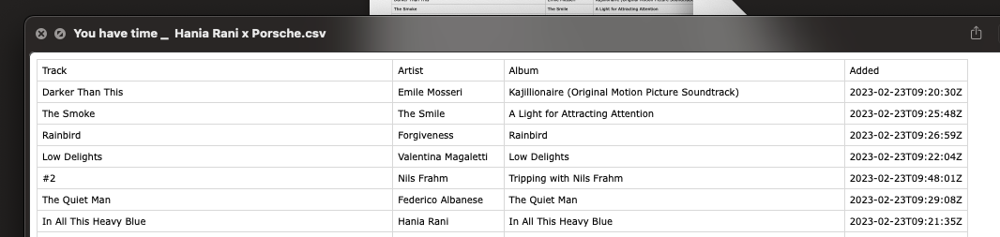

# Spotify Playlist Archiver
## What is this?
This is a tool allowing me to make a csv of songs in any of my Spotify playlists.



## What is in the csv?
An archive is a csv with a list of all the songs in any single playlist. The filename is the playlist name.



## Describe the tech
There is a go backend, which serves some vanilla html, js and css, and handles the fetching of data from Spotify's api.

## How do I run this?
> This is for *me*, to be used once I forget.

First you'll need to bundle the web assets, both css and js. This process was not as streamlined or "production" ready as it could be. My choices were based more out of wanting to see what I could do with minimal tools than of wanting an enterprise grade setup.

To bundle the stylesheets, you'll need tailwind. If you are on an arm Mac, I've provided a `make` recipe.

There are two stylesheet bundling recipes, `make tailwind-watch-components` and `make tailwind-watch-templates`. Each of these will ensure you have the tailwind cli installed, (again, assuming you are on an arm Mac).

Then there is a command for bundling the js: `make bundle-js`. There are just two vanilla classes that are copied into an un-minified file in the public assets folder.

Now the assets are bundled. What remains is the setting of environment values. You'll need a Spotify developer account, and to set up a project with some configuration, I won't get into the specifics, but there is a redirect url and some permission slugs. These are for the telling the user what data you'll have access to, and where to send the user after they authenticate. All of this is free btw, and takes only a few minutes.

With that done, you'll just need to set the values in the appropriate entries in the .env file.

Now the app can be run with:
```shell
go run .
```
